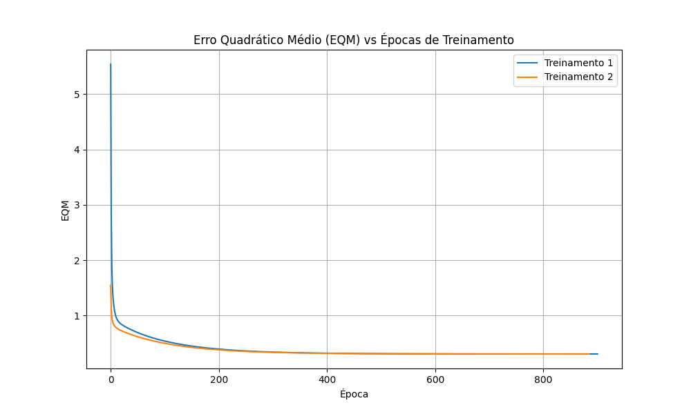

# Respostas - Rede Neural ADALINE

Este documento contém as respostas para os exercícios práticos desenvolvidos com a rede ADALINE utilizando a Regra Delta.

---

## Questão 2: Registro dos Resultados dos 5 Treinamentos

A tabela abaixo apresenta os vetores de pesos iniciais gerados aleatoriamente, os vetores de pesos finais obtidos após a convergência, e o número de épocas necessárias para cada um dos 5 treinamentos (T1 a T5).

| Treinamento | Vetor de Pesos Inicial ($w_0$, $w_1$, $w_2$, $w_3$, $w_4$) | Vetor de Pesos Final ($w_0$, $w_1$, $w_2$, $w_3$, $w_4$) | Número de Épocas |
| :---: | :---: | :---: | :---: |
| **1º (T1)** | [0.7149, 0.1573, 0.8923, 0.3994, 0.7576] | [-1.8112, 1.3126, 1.6414, -0.4263, -1.1771] | 901 |
| **2º (T2)** | [0.4331, 0.5506, 0.6277, 0.5954, 0.0855] | [-1.8112, 1.3126, 1.6414, -0.4263, -1.1771] | 885 |
| **3º (T3)** | [0.4431, 0.8641, 0.1779, 0.0454, 0.1395] | [-1.8113, 1.3125, 1.6414, -0.4265, -1.1771] | 876 |
| **4º (T4)** | [0.0138, 0.9756, 0.8974, 0.0616, 0.5432] | [-1.8114, 1.3125, 1.6414, -0.4266, -1.1771] | 837 |
| **5º (T5)** | [0.5173, 0.7678, 0.0251, 0.3246, 0.3621] | [-1.8113, 1.3126, 1.6414, -0.4264, -1.1771] | 899 |

---

## Questão 3: Gráfico do Erro Quadrático Médio (EQM)

O gráfico a seguir ilustra a queda do Erro Quadrático Médio (EQM) em função do número de épocas para os dois primeiros treinamentos (T1 e T2). Como os dois treinamentos convergem para o mesmo erro mínimo e têm a mesma taxa de aprendizado, suas curvas são praticamente sobrepostas.

---

## Questão 4: Classificação das Amostras de Teste

Para todos os treinamentos realizados, aplicou-se a rede ADALINE para classificar e indicar ao comutador se os sinais devem ser encaminhados para a **válvula A (-1)** ou **válvula B (+1)**.

Como esperado, os 5 treinamentos (T1 a T5) convergiram para o mesmo hiperplano de separação. Abaixo está a tabela preenchida com as saídas $y$ obtidas para as 15 amostras:

| Amostra | $y(T1)$ | $y(T2)$ | $y(T3)$ | $y(T4)$ | $y(T5)$ |
| :---: | :---: | :---: | :---: | :---: | :---: |
| **1** | -1 | -1 | -1 | -1 | -1 |
| **2** | -1 | -1 | -1 | -1 | -1 |
| **3** | 1 | 1 | 1 | 1 | 1 |
| **4** | -1 | -1 | -1 | -1 | -1 |
| **5** | -1 | -1 | -1 | -1 | -1 |
| **6** | 1 | 1 | 1 | 1 | 1 |
| **7** | 1 | 1 | 1 | 1 | 1 |
| **8** | 1 | 1 | 1 | 1 | 1 |
| **9** | 1 | 1 | 1 | 1 | 1 |
| **10** | -1 | -1 | -1 | -1 | -1 |
| **11** | -1 | -1 | -1 | -1 | -1 |
| **12** | 1 | 1 | 1 | 1 | 1 |
| **13** | -1 | -1 | -1 | -1 | -1 |
| **14** | -1 | -1 | -1 | -1 | -1 |
| **15** | 1 | 1 | 1 | 1 | 1 |

---

## Questão 5: Análise dos Pesos Finais

**Pergunta:** Embora o número de épocas de cada treinamento realizado seja diferente, explique por que então os valores dos pesos continuam praticamente inalterados.

**Resposta:**

Isso ocorre devido à **natureza da função de custo (ou superfície de erro) da rede ADALINE**. Diferente de redes neurais multicamadas complexas que podem possuir vários mínimos locais, o Erro Quadrático Médio (EQM) de um único neurônio linear (ADALINE) forma uma figura geométrica descrita como um **hiperparaboloide estritamente convexo**. 

Isso significa que **existe apenas um único ponto de mínimo global** para o erro.

Durante o treinamento:
1. **Diferença nas Épocas:** Os pesos iniciais são gerados aleatoriamente. Por isso, cada treinamento (T1 a T5) inicia em um ponto totalmente diferente e imprevisível na superfície de erro, necessitando percorrer trajetórias distintas — e consequentemente distâncias e quantidades diferentes de passos (épocas) — para chegar até o fundo do "poço".
2. **Mesmos Pesos Finais:** Como o algoritmo da Regra Delta utiliza a descida do gradiente iterativa com uma taxa de aprendizado adequada e suficientemente pequena ($\eta = 0.0025$), a rede invariavelmente "escorregará" em direção ao ponto mais baixo dessa mesma superfície em todos os cenários.

Portanto, por se tratar de uma função estritamente convexa, a rede sempre convergirá para **exatamente a mesma configuração ótima de pesos**, independentemente do seu local de partida. A variação irrisória e marginal observada na casa de várias casas decimais entre os vetores de peso ocorre apenas por conta da tolerância de precisão (critério de parada $\epsilon = 10^{-6}$), que interrompe o algoritmo assim que ele está estável no fundo absoluto.
