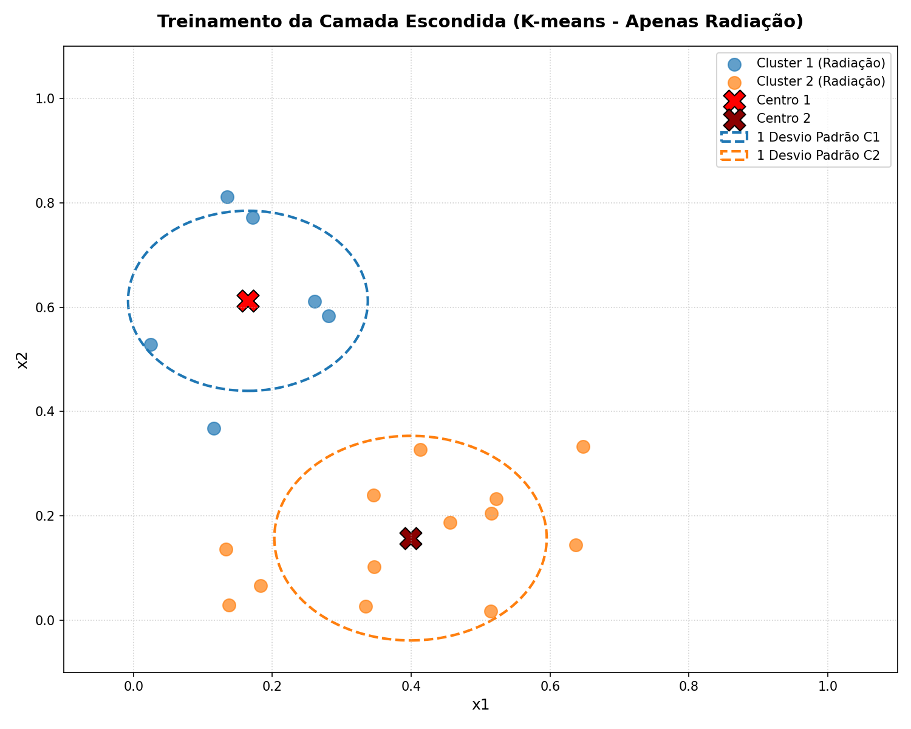
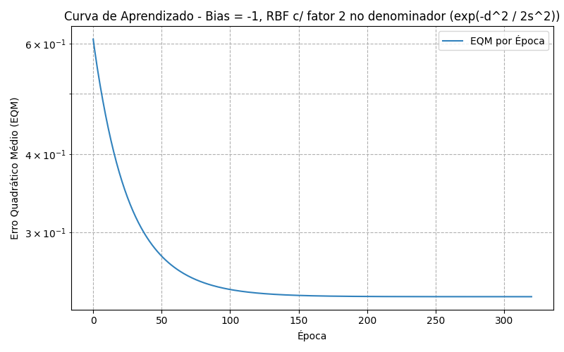
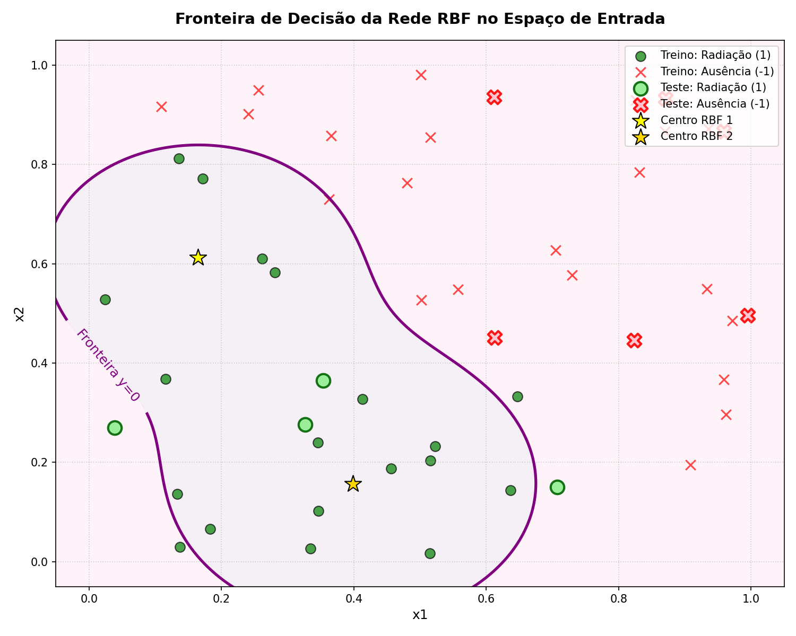

# Relatório de Respostas - Atividade RBF1 (Presença de Radiação)

**Curso:** Bacharelado em Sistemas de Informação  
**Disciplina:** Lab. Inteligência Artificial  
**Professor:** Lázaro Eduardo da Silva  
**CEFET-MG - Campus VIII - Varginha**

---

## 1. Treinamento da Camada Escondida (Algoritmo K-means)

Conforme instruído, o algoritmo **K-means** foi executado para agrupar as amostras em **$K = 2$ clusters**, levando em consideração **apenas as amostras da classe positiva** (com presença de radiação, ou seja, $d = 1$). No conjunto de treinamento de 40 amostras, existem exatamente **19 padrões com $d = 1$**.

O algoritmo foi inicializado utilizando as duas primeiras amostras positivas encontradas no conjunto de dados (Amostra 3 e Amostra 4 do Apêndice):
*   **Centro Inicial do Cluster 1 ($c_1^{(0)}$):** $[0.1157, 0.3676]$
*   **Centro Inicial do Cluster 2 ($c_2^{(0)}$):** $[0.5147, 0.0167]$

Após a convergência (que ocorreu em poucas iterações), os centros finais dos dois clusters e suas respectivas variâncias ($\sigma^2$) e desvios padrão ($\sigma$) foram calculados. A variância foi computada como o erro quadrático médio de cada ponto pertencente ao cluster em relação ao seu respectivo centro:
$$\sigma_j^2 = \frac{1}{N_j} \sum_{x \in S_j} \|x - c_j\|^2$$

Abaixo estão os resultados obtidos:

| Cluster | Centro ($x_1$, $x_2$) | Variância ($\sigma^2$) | Desvio Padrão ($\sigma$) | Nº de Amostras |
| :---: | :---: | :---: | :---: | :---: |
| **1** | $(0.164833, 0.612117)$ | $0.029806$ | $0.172643$ | 6 |
| **2** | $(0.398969, 0.157131)$ | $0.038460$ | $0.196112$ | 13 |

### Visualização do Agrupamento K-means
Abaixo está o gráfico gerado pelo script que ilustra o posicionamento dos 19 pontos positivos com seus respectivos centros finais e o raio de 1 desvio padrão ($\sigma$) de cada cluster:

---

## 2. Treinamento da Camada de Saída (Regra Delta Generalizada)

Após o treinamento da camada escondida, as ativações das funções de base radial (RBF) gaussianas foram calculadas para cada padrão da base de dados. O neurônio da camada de saída possui comportamento linear e foi treinado via **Regra Delta** em modo online (padrão a padrão, mantendo coerência com a metodologia dos demais laboratórios como o Adaline).

Foram utilizadas as seguintes especificações:
*   Taxa de aprendizado: $\eta = 0.01$
*   Critério de parada (Precisão): $\epsilon = 10^{-7}$ ($|EQM_{atual} - EQM_{anterior}| < 10^{-7}$)
*   Inicialização dos pesos: Aleatória no intervalo $[0, 1)$ com semente fixa para reprodutibilidade.

Como há duas convenções clássicas na literatura para o fator de largura da gaussiana (com ou sem o fator $2$ no denominador) e para o valor de bias ($x_0 = -1$ ou $x_0 = 1$), os resultados foram simulados para todas as combinações:

### Resultados dos Pesos Finais do Neurônio de Saída

| Configuração | Épocas | EQM Final | Peso Bias ($W_{21,0}$) | Peso RBF 1 ($W_{21,1}$) | Peso RBF 2 ($W_{21,2}$) |
| :--- | :---: | :---: | :---: | :---: | :---: |
| **1. Bias = -1, RBF c/ 2 no denom.** (Recomendado) | **321** | **0.237079** | **1.002535** | **2.377560** | **2.697506** |
| 2. Bias = -1, RBF s/ 2 no denom. | 518 | 0.392728 | 0.684489 | 3.007206 | 2.682562 |
| 3. Bias = +1, RBF c/ 2 no denom. | 326 | 0.237079 | -1.002558 | 2.377655 | 2.697545 |
| 4. Bias = +1, RBF s/ 2 no denom. | 521 | 0.392728 | -0.684488 | 3.007193 | 2.682559 |

> [!NOTE]
> Observa-se que a formulação clássica (Gaussiana com fator de 2: $\exp\left( -\frac{\|x-c\|^2}{2\sigma^2} \right)$) atinge uma convergência mais rápida (321 épocas) e um Erro Quadrático Médio (EQM) significativamente menor (~0.237) do que a versão sem o fator de 2.

Abaixo está o gráfico da curva de aprendizado (EQM vs Épocas) para a melhor configuração:

---

## 3. Pós-processamento e Validação no Conjunto de Teste

Para o problema de classificação de padrões, a saída real da rede ($y$) foi submetida a um pós-processamento utilizando a função sinal:
$$y_{pós} = \begin{cases} 
1, & \text{se } y \ge 0 \\ 
-1, & \text{se } y < 0 
\end{cases}$$

A tabela abaixo apresenta os resultados detalhados obtidos no conjunto de teste inédito (10 amostras) para a nossa RBF recomendada (**Bias = -1 e fator 2 no denominador**):

| Amostra | $x_1$ | $x_2$ | Desejado ($d$) | Saída Rede ($y$) | Saída Pós-processada ($y_{pós}$) | Resultado |
| :---: | :---: | :---: | :---: | :---: | :---: | :---: |
| **1** | $0.8705$ | $0.9329$ | $-1$ | $-1.0024$ | $-1$ | **Correto** |
| **2** | $0.0388$ | $0.2703$ | $1$ | $-0.3231$ | $-1$ | *Incorreto* |
| **3** | $0.8236$ | $0.4458$ | $-1$ | $-0.9139$ | $-1$ | **Correto** |
| **4** | $0.7075$ | $0.1502$ | $1$ | $-0.2200$ | $-1$ | *Incorreto* |
| **5** | $0.9587$ | $0.8663$ | $-1$ | $-1.0024$ | $-1$ | **Correto** |
| **6** | $0.6115$ | $0.9365$ | $-1$ | $-0.9877$ | $-1$ | **Correto** |
| **7** | $0.3534$ | $0.3646$ | $1$ | $0.9664$ | $1$ | **Correto** |
| **8** | $0.3268$ | $0.2766$ | $1$ | $1.3231$ | $1$ | **Correto** |
| **9** | $0.6129$ | $0.4518$ | $-1$ | $-0.4681$ | $-1$ | **Correto** |
| **10** | $0.9948$ | $0.4962$ | $-1$ | $-0.9965$ | $-1$ | **Correto** |

### **Taxa de Acerto (%): 80.0%**

---

## 4. Análise da Taxa de Acerto e Fronteira de Decisão

A RBF obteve uma **taxa de acerto de 80.0%** no conjunto de teste.
Para compreender detalhadamente o porquê dos erros nas amostras **2** e **4**, analisamos a fronteira de decisão traçada no espaço bidimensional de entrada:

### Justificativa dos Erros:
Como os centros e as variâncias dos neurônios da camada escondida foram computados levando-se em consideração **apenas** as amostras com presença de radiação ($d = 1$), a rede RBF cria uma região de classificação positiva restrita às vizinhanças dessas nuvens gaussianas (representadas pelas estrelas amarelas/douradas).

*   **Amostra 2** ($x_1=0.0388$, $x_2=0.2703$) e **Amostra 4** ($x_1=0.7075$, $x_2=0.1502$) são amostras positivas reais de teste ($d=1$), contudo estão localizadas em posições muito periféricas e distantes da maior densidade dos dados de treino positivos (são outliers).
*   Como a distância dessas amostras aos centros $c_1$ e $c_2$ é grande, as saídas das RBFs decaem exponencialmente para valores muito próximos de zero ($\phi_1(x) \approx 0$ e $\phi_2(x) \approx 0$).
*   Sem a excitação dos neurônios radiais, a saída da rede é governada inteiramente pelo bias: $y \approx w_0 \cdot x_0 = (1.0025) \cdot (-1) = -1.0025$. 
*   Como esse valor é negativo, a rede classifica incorretamente essas amostras periféricas como ausência de radiação ($y_{pós} = -1$). 

---

## 5. Estratégias para Aumentar a Taxa de Acerto da RBF

Para melhorar a capacidade de generalização e elevar a taxa de acerto de 80% para patamares superiores, podemos adotar as seguintes estratégias:

1.  **Aumentar o número de neurônios da camada intermediária ($K > 2$):**  
    A utilização de apenas 2 centros limita severamente a habilidade da rede de modelar distribuições mais complexas ou espalhadas no espaço de entrada. Ao aumentar $K$, permitimos que clusters menores e mais isolados (como as regiões periféricas onde estão as amostras 2 e 4) sejam mapeados por novos centros radial-gaussianos dedicados.
2.  **Agrupar padrões de ambas as classes ($d = 1$ e $d = -1$):**  
    O K-means poderia ser executado em todo o conjunto de dados (ou separadamente para cada classe) para alocar centros tanto para as áreas de presença quanto de ausência de radiação. Dessa forma, as duas classes seriam representadas por funções de base localizadas, em vez de deixar a classe negativa ser simplesmente o "padrão de fundo" modelado indiretamente pelo viés (bias).
3.  **Ajuste Fino Supervisionado dos Centros e Variâncias:**  
    Em vez de mantermos os centros e variâncias fixados após o K-means não-supervisionado, podemos treiná-los de ponta a ponta junto com a camada de saída. Usando o algoritmo de retropropagação do erro (*Backpropagation*), os pesos da saída ($w$), as coordenadas dos centros ($c$) e as larguras ($\sigma$) seriam otimizados conjuntamente para minimizar o erro quadrático global.
4.  **Otimização das Variâncias via Validação Cruzada:**  
    A variância local do cluster calculada diretamente do K-means pode não ser a melhor largura para a gaussiana de classificação. Utilizar estratégias de validação cruzada para varrer um multiplicador escalar de $\sigma$ (como $\gamma \cdot \sigma^2$) pode ajustar a suavidade e o alcance da fronteira de decisão, reduzindo o sobreajuste e melhorando a classificação de amostras periféricas.
5.  **Normalização ou Padronização Avançada dos Dados:**  
    A aplicação de transformações estatísticas adicionais que espalhem melhor as variáveis $x_1$ e $x_2$ pode contribuir para que o K-means identifique com maior clareza centros representativos de subpopulações de dados.
