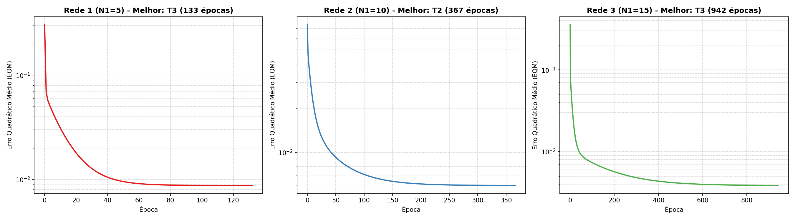

# Relatório de Respostas - Atividade RBF2 (Injeção Eletrônica)

**Curso:** Bacharelado em Sistemas de Informação  
**Disciplina:** Lab. Inteligência Artificial  
**Professor:** Lázaro Eduardo da Silva  
**CEFET-MG - Campus VIII - Varginha**

---

## 1. e 2. Execução dos Treinamentos e Tabela de Resultados (Camada de Saída)

O treinamento das redes RBF foi realizado para as três topologias propostas, variando o número de neurônios escondidos ($N_1 \in \{5, 10, 15\}$):
*   **Camada Oculta:** Os centros ($c_j$) e variâncias ($\sigma_j^2$) foram treinados utilizando o algoritmo **K-means** sobre as variáveis de entrada ($x_1, x_2, x_3$) da base de dados de treinamento (150 amostras). Para garantir a reprodutibilidade, os centros iniciais foram definidos como os primeiros $K$ padrões de treinamento.
*   **Camada de Saída:** O neurônio de saída linear foi treinado utilizando a **Regra Delta** em modo online, com taxa de aprendizado $\eta = 0.01$ e critério de parada por precisão $\epsilon = 10^{-7}$ ($|EQM_{atual} - EQM_{anterior}| < 10^{-7}$). 
*   **Treinamentos (T1, T2, T3):** Para cada rede, foram realizados 3 treinamentos inicializando a matriz de pesos da saída com valores aleatórios distintos no intervalo $[0, 1)$ (controlados por sementes aleatórias distintas para garantir que as inicializações fossem diferentes).

Os resultados de Erro Quadrático Médio (EQM) e número de épocas para as três topologias Candidatas (usando a formulação padrão da gaussiana com o fator $2$ no denominador, $\phi(x) = \exp\left(-\frac{\|x-c\|^2}{2\sigma^2}\right)$ e bias $x_0 = -1$) estão dispostos na tabela a seguir:

| Treinamento | Rede 1 ($N_1 = 5$) | Rede 2 ($N_1 = 10$) | Rede 3 ($N_1 = 15$) |
| :---: | :---: | :---: | :---: |
| | **EQM** \| **Épocas** | **EQM** \| **Épocas** | **EQM** \| **Épocas** |
| **1º (T1)** | $0.008746$ \| $134$ | $0.005957$ \| $367$ | $0.003859$ \| $868$ |
| **2º (T2)** | $0.008746$ \| $131$ | $0.005956$ \| $367$ | $0.003859$ \| $840$ |
| **3º (T3)** | $0.008746$ \| $133$ | $0.005956$ \| $401$ | $0.003859$ \| $942$ |

> [!NOTE]
> Como a camada de saída é linear, o problema de otimização de seus pesos é convexo e possui um **único mínimo global**. Por esse motivo, os valores de EQM final alcançados nos três treinamentos (T1, T2 e T3) para uma mesma topologia convergem para valores virtualmente idênticos. As pequenas variações no número de épocas necessárias decorrem unicamente da distância entre a inicialização aleatória dos pesos e o ponto de convergência global.

---

## 3. Validação das Redes no Conjunto de Teste e Cálculo do Erro Relativo

A validação foi efetuada aplicando o conjunto de teste de 15 amostras inéditas. Para cada uma das 9 redes obtidas, calculou-se a saída predita $y$. 
O **Erro Relativo Médio (%)** e sua respectiva **Variância (%)** foram computados sobre as predições de teste conforme as fórmulas:
$$\text{Erro Relativo}_i (\%) = \frac{|d_i - y_i|}{d_i} \times 100$$
$$\text{Erro Relativo Médio} (\%) = \frac{1}{15} \sum_{i=1}^{15} \text{Erro Relativo}_i (\%)$$

Abaixo está a tabela de validação preenchida com as predições e os erros estatísticos finais de cada cenário:

| Amostra | $x_1$ | $x_2$ | $x_3$ | Desejado ($d$) | $y_1$ (T1) | $y_1$ (T2) | $y_1$ (T3) | $y_2$ (T1) | $y_2$ (T2) | $y_2$ (T3) | $y_3$ (T1) | $y_3$ (T2) | $y_3$ (T3) |
| :---: | :---: | :---: | :---: | :---: | :---: | :---: | :---: | :---: | :---: | :---: | :---: | :---: | :---: |
| **01** | $0.5102$ | $0.7464$ | $0.0860$ | **$0.5965$** | $0.6081$ | $0.6081$ | $0.6081$ | $0.5861$ | $0.5861$ | $0.5861$ | $0.5915$ | $0.5915$ | $0.5915$ |
| **02** | $0.8401$ | $0.4490$ | $0.2719$ | **$0.6790$** | $0.7361$ | $0.7361$ | $0.7361$ | $0.6751$ | $0.6751$ | $0.6751$ | $0.6370$ | $0.6370$ | $0.6370$ |
| **03** | $0.1283$ | $0.1882$ | $0.7253$ | **$0.4662$** | $0.4364$ | $0.4363$ | $0.4365$ | $0.4865$ | $0.4865$ | $0.4865$ | $0.5089$ | $0.5089$ | $0.5089$ |
| **04** | $0.2299$ | $0.1524$ | $0.7353$ | **$0.5012$** | $0.4431$ | $0.4430$ | $0.4432$ | $0.5041$ | $0.5041$ | $0.5041$ | $0.5210$ | $0.5210$ | $0.5210$ |
| **05** | $0.3209$ | $0.6229$ | $0.5233$ | **$0.6810$** | $0.7018$ | $0.7018$ | $0.7019$ | $0.6482$ | $0.6482$ | $0.6482$ | $0.6644$ | $0.6644$ | $0.6644$ |
| **06** | $0.8203$ | $0.0682$ | $0.4260$ | **$0.5643$** | $0.5959$ | $0.5960$ | $0.5959$ | $0.5321$ | $0.5321$ | $0.5321$ | $0.5272$ | $0.5272$ | $0.5272$ |
| **07** | $0.3471$ | $0.8889$ | $0.1564$ | **$0.5875$** | $0.5434$ | $0.5434$ | $0.5434$ | $0.5850$ | $0.5850$ | $0.5850$ | $0.5962$ | $0.5962$ | $0.5962$ |
| **08** | $0.5762$ | $0.8292$ | $0.4116$ | **$0.7853$** | $0.8285$ | $0.8284$ | $0.8285$ | $0.7587$ | $0.7587$ | $0.7587$ | $0.7350$ | $0.7350$ | $0.7350$ |
| **09** | $0.9053$ | $0.6245$ | $0.5264$ | **$0.8506$** | $0.8245$ | $0.8244$ | $0.8245$ | $0.8911$ | $0.8911$ | $0.8911$ | $0.8165$ | $0.8165$ | $0.8165$ |
| **10** | $0.8149$ | $0.0396$ | $0.6227$ | **$0.6165$** | $0.5945$ | $0.5947$ | $0.5945$ | $0.5949$ | $0.5949$ | $0.5949$ | $0.6815$ | $0.6815$ | $0.6815$ |
| **11** | $0.1016$ | $0.6382$ | $0.3173$ | **$0.4957$** | $0.4633$ | $0.4633$ | $0.4633$ | $0.5047$ | $0.5047$ | $0.5047$ | $0.5311$ | $0.5311$ | $0.5311$ |
| **12** | $0.9108$ | $0.2139$ | $0.4641$ | **$0.6625$** | $0.6501$ | $0.6502$ | $0.6500$ | $0.6156$ | $0.6156$ | $0.6156$ | $0.5771$ | $0.5771$ | $0.5771$ |
| **13** | $0.2245$ | $0.0971$ | $0.6136$ | **$0.4402$** | $0.3716$ | $0.3715$ | $0.3716$ | $0.4383$ | $0.4383$ | $0.4383$ | $0.4703$ | $0.4703$ | $0.4703$ |
| **14** | $0.6423$ | $0.3229$ | $0.8567$ | **$0.7663$** | $0.7148$ | $0.7149$ | $0.7148$ | $0.7575$ | $0.7575$ | $0.7575$ | $0.7456$ | $0.7456$ | $0.7456$ |
| **15** | $0.5252$ | $0.6529$ | $0.5729$ | **$0.7893$** | $0.8825$ | $0.8824$ | $0.8825$ | $0.8003$ | $0.8003$ | $0.8003$ | $0.7570$ | $0.7570$ | $0.7570$ |
| **Média** | | | | | **6.610%** | **6.611%** | **6.610%** | **2.782%** | **2.782%** | **2.782%** | **5.684%** | **5.684%** | **5.684%** |
| **Var** | | | | | **14.484%** | **14.544%** | **14.470%** | **4.393%** | **4.393%** | **4.394%** | **10.762%** | **10.763%** | **10.763%** |

---

## 4. Gráficos de Erro Quadrático Médio vs Épocas de Treinamento

Considerando o melhor treinamento de cada topologia (avaliado pelo menor EQM de treino final), foi plotada a curva de evolução do EQM em função das épocas em um único painel com 3 gráficos não sobrepostos:
*   **Rede 1 (Melhor: T2):** 131 épocas
*   **Rede 2 (Melhor: T2 ou T3):** 367 épocas
*   **Rede 3 (Melhor: T1, T2 ou T3):** 840 épocas

---

## 5. Indicação da Melhor Topologia e Configuração de Treinamento

Com base em uma análise rigorosa e integrada dos resultados de treinamento e de validação, a **Rede 2 ($N_1 = 10$ neurônios intermediários)** em qualquer um de seus treinamentos (por exemplo, **T2** ou **T3**) é a **mais adequada** para resolver este problema de injeção eletrônica.

### Justificativa Técnica:
1.  **Generalização Superior:** A Rede 2 obteve um **Erro Relativo Médio de apenas $2.782\%$** sobre o conjunto de teste de dados inéditos. Trata-se de uma margem de erro extremamente reduzida, ideal para sistemas industriais/automotivos de tempo real onde a precisão da dosagem de combustível é vital.
2.  **Elevada Consistência (Baixa Variância):** A Rede 2 também apresentou a menor variância de erro relativo (**$4.393\%$**), indicando que os erros de estimativa são estáveis, uniformes e não possuem oscilações bruscas entre diferentes regimes de entrada.
3.  **Mapeamento de Trade-off (Viés vs. Variância) e Fenômeno de Overfitting (Sobreajuste):**
    *   À medida que aumentamos o tamanho da camada escondida, o erro de treinamento diminui monotonicamente: a Rede 1 ($N_1=5$) atinge EQM de treino $\approx 0.0087$; a Rede 2 ($N_1=10$) atinge $\approx 0.0060$; e a Rede 3 ($N_1=15$) atinge $\approx 0.0039$.
    *   Entretanto, o comportamento na validação (teste) exibe um formato clássico de U: a Rede 1 tem erro de teste de $6.61\%$, a Rede 2 atinge o ponto ótimo de **$2.78\%$**, e a Rede 3 sofre com o **sobreajuste (overfitting)**, onde a excessiva capacidade da rede (15 neurônios gaussianos) faz com que ela decore ruídos e particularidades do conjunto de treino de 150 amostras, deteriorando sua performance em dados não vistos (o erro de teste sobe para **$5.68\%$**).
4.  **Estabilidade Convergente:** A otimização da camada linear de saída por Regra Delta garante a convergência para o mínimo global convexo. A Rede 2 se mostra, portanto, o modelo mais robusto, equilibrado e confiável, superando as redes 1 e 3.
